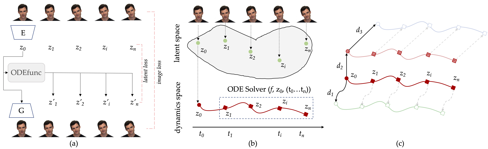

# dynode


This repository contains the implementation of the following paper:

> **Modeling the Latent Dynamics of StyleGAN using Neural ODEs** <br>
> Weihao Xia, Yujiu Yang, Jing-Hao Xue <br>
> arXiv preprint arXiv:2208.11197

[[**Paper**](https://arxiv.org/abs/2208.11197)] [[**Demo**](https://github.com/weihaox/dynode)]

Recent GAN inversion based video editing methods have shown that even equipped with an offthe-shelf and non-temporal StyleGAN, the elusive temporal coherency, an essential requirement for video tasks to meet, can be achieved by maintaining that of the original video during inversion and latent editing processes. These methods, however, require frame-by-frame operations. The operations are almost the same across all frames, which makes us wonder: **could these operations be applied just to the first frame**, or specifically, **could we change attributes for the entire video by only applying a latent editing method to the initial latent code**?

Instead of developing alternative GAN architectures or inversion methods for videos, we model the *trajectory* of the *isolated latent codes* to apply existing inversion techniques to video tasks.

## Framework

<div align=center>

</div>

Framework of the proposed _DynODE_. (a) The neural ODE network ($\mathtt{ODEfunc}$, $f_{\theta}$) is trained to predict the subsequent latent states given the initial state by minimizing the losses in the latent, feature, and image spaces.
(b) The original latent space is mapped into a dynamic space. These latent codes $\{z_0, \cdots, z_n\}$ in the latent space becomes discrete-time observations $\{{z}(t_0), \cdots, {z}(t_n)\}$ of a continuous trajectory of the initial latent state in the dynamic space.
The latent codes corresponding to different frames are reformulated as state transitions of the first frame, which can be modeled by using neural ODEs. (c) The desired video attributes could be edited by changing the first frame and extending such modifications to all subsequent frames.
These attributes could be altered by applying a direction, either nonlinear ($d_1$) or linear ($d_2$ and $d_3$), to the initial latent code.

## Example

We provide a simple demo showcasing the idea of modeling the *trajectory* of *isolated latent codes* using neural ODE networks. Data [examples](https://github.com/weihaox/dynode/tree/main/data/example) are already included in this repository. The pretrained StyleGAN2 generator can be manually downloaded from [here](https://drive.google.com/file/d/1EM87UquaoQmk17Q8d5kYIAHqu0dkYqdT/view?usp=sharing) or be automatically retrived by using the following command:

```bash
gdown https://drive.google.com/uc?id=1EM87UquaoQmk17Q8d5kYIAHqu0dkYqdT -O ../ckpts/pretrained_models/
```

After allocating the data and pretrained models to the appropriate directory, you will be able to run the model: 

```bash
python demo.py --mode train
```

The learned nerual ODEfunc models the dynamics of the given video clip. 

## Result

<div align=center>

</div>

**Figure**. Results of dynamic modeling at both observed and unobserved times. We sample frames at regular and irregular time
intervals and compare the predicted frames with the actual ones at both observed and unobserved time points.

<div align=center>

</div>

**Figure**. Results of continuous frame interpolation for talking faces and outdoor natural scenes. Based on given frames in (a), our method
can generate in-between video frames in diverse time intervals

<div align=center>

</div>

**Figure**. Results of consistent video manipulation for talking heads and outdoor natural scenes. Our method changes the desired attributes
of the entire video by altering the initial frame and extending such modifications to the entire sequence, without the need to apply redundant
operations to every frame. The manipulated frames of the entire video show identical video dynamics and maintain temporal coherence,
even when the facial identity in the first frame appears to have drifted after editing.

## BibTeX

If you find our work helpful for your research, please consider to cite:
```bibtex
@article{xia2022gan,
  title={GAN Inversion for Consistent Video Interpolation and Manipulation},
  author={Xia, Weihao and Yang, Yujiu and Xue, Jing-Hao},
  journal={arXiv preprint arXiv:2208.11197},
  year={2022}
}
```