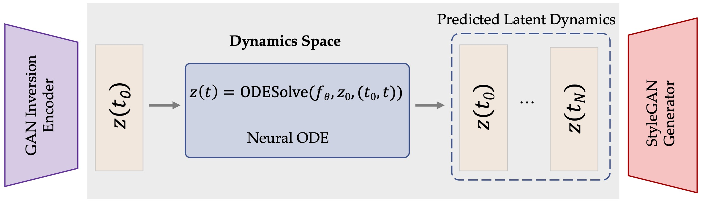
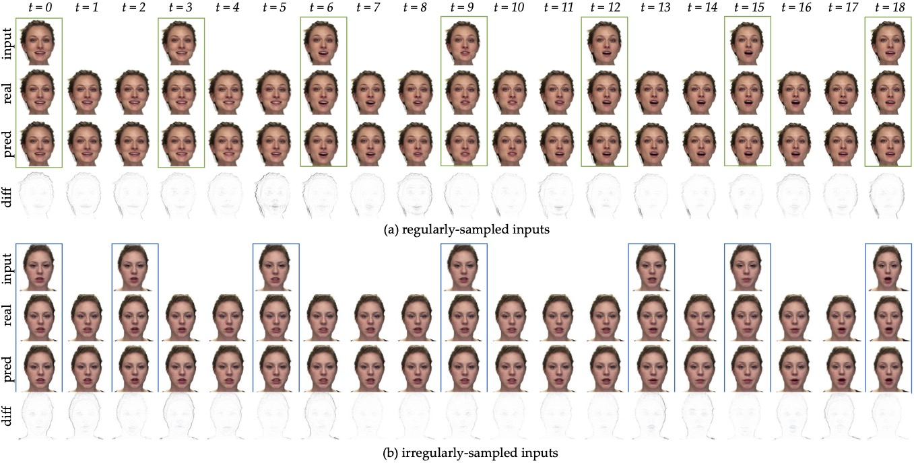
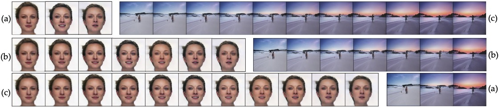
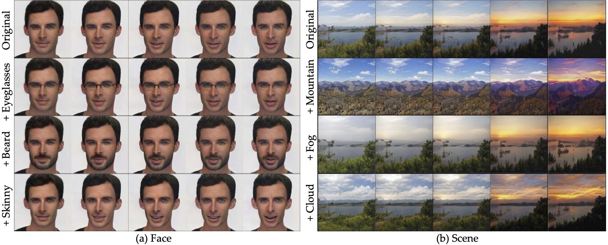

<div align="center">

<h2>Modeling GAN Latent Dynamics using Neural ODEs</h2>

<div>
    <a href='https://weihaox.github.io/' target='_blank'>Weihao Xia</a><sup>1</sup>&emsp;
    <a href='https://sites.google.com/view/iigroup-thu/home' target='_blank'>Yujiu Yang</a><sup>2</sup>&emsp;
    <a href='http://www.homepages.ucl.ac.uk/~ucakjxu/' target='_blank'>Jing-Hao Xue</a><sup>1</sup>&emsp;
</div>
<div>
    <sup>1</sup>University College London&emsp;
    <sup>2</sup>Tsinghua University&emsp;
</div>

---

<h4 align="center">
  <a href="https://github.com/weihaox/dynode_released" target='_blank'>[Demo]</a> •
  <a href="https://arxiv.org/abs/2208.11197" target='_blank'>[arXiv]</a> <br> <br>
  
</h4>

</div>

>**Abstract:** In this paper, we propose DynODE, a method to model the video dynamics by learning the trajectory of independently inverted latent codes from GANs. The entire sequence is seen as discrete-time observations of a continuous trajectory of the initial latent code.
The latent codes representing different frames are therefore reformulated as state transitions of the initial frame, which can be modeled by neural ordinary differential equations. Our DynODE learns the holistic geometry of the video dynamic space from given sparse observations and specifies continuous latent states, allowing us to engage in various video applications such as frame interpolation and video editing. Extensive experiments demonstrate that our method achieves state-of-the-art performance but with much less computation.

<div align="center">
<tr>
    
</tr>
</div>

## Usage

We provide a simple demo showcasing the idea of modeling the *trajectory* of *isolated latent codes* using neural ODE networks. Data [examples](https://github.com/weihaox/dynode/tree/main/data/example) are already included in this repository. The pretrained StyleGAN2 generator can be manually downloaded from [here](https://drive.google.com/file/d/1EM87UquaoQmk17Q8d5kYIAHqu0dkYqdT/view?usp=sharing) or be automatically retrived by using the following command:

```bash
gdown https://drive.google.com/uc?id=1EM87UquaoQmk17Q8d5kYIAHqu0dkYqdT -O ../ckpts/pretrained_models/
```

After allocating the data and pretrained models to the appropriate directory, you will be able to run the model: 

```bash
python demo.py --mode train
```

The learned nerual ODEfunc models the dynamics of the given video clip. 

## Result

<div align=center>

</div>

**Figure**. Results of dynamic modeling at both observed and unobserved times. We sample frames at regular and irregular time
intervals and compare the predicted frames with the actual ones at both observed and unobserved time points.

<div align=center>

</div>

**Figure**. Results of continuous frame interpolation for talking faces and outdoor natural scenes. Based on given frames in (a), our method
can generate in-between video frames in diverse time intervals

<div align=center>

</div>

**Figure**. Results of consistent video manipulation for talking heads and outdoor natural scenes. Our method changes the desired attributes
of the entire video by altering the initial frame and extending such modifications to the entire sequence, without the need to apply redundant
operations to every frame. The manipulated frames of the entire video show identical video dynamics and maintain temporal coherence,
even when the facial identity in the first frame appears to have drifted after editing.

## BibTeX

If you find our work helpful for your research, please consider citing:
```bibtex
@inproceedings{xia2023modeling,
  title={Modeling GAN Latent Dynamics using Neural ODEs},
  author={Xia, Weihao and Yang, Yujiu and Xue, Jing-Hao},
  booktitle={NeurIPS Workshop},
  year={2023}
}
```